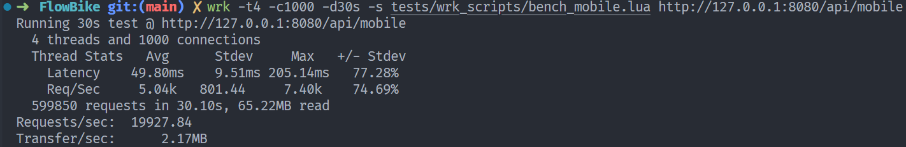
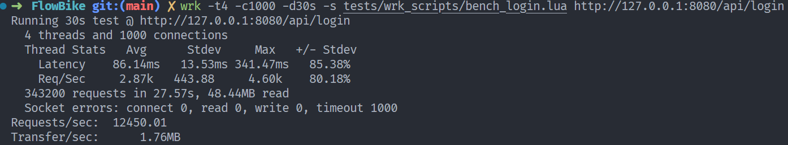
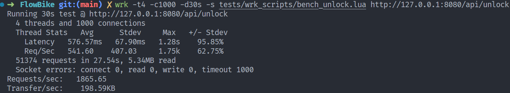

# FlowBike - 高性能共享单车后端服务 (High-Performance C++ Backend)

基于 C++17 实现的高并发共享单车业务后端，采用 Reactor 网络模型，集成 MySQL/Redis 冷热分离存储架构。 在 WSL2 环境下，使用 wrk 进行压测，核心网络层吞吐量达到 **19,900+** QPS，高频缓存业务 QPS 达到 **12,400+**。

## 🚀 核心特性 (Key Features)

* **HTTP + Protobuf 架构**：采用 HTTP/1.1 协议传输 Protobuf 二进制载荷，兼顾了 Web 标准兼容性与极致的序列化性能。
* **高性能网络**：基于 `Libevent` 封装 Reactor 模型，采用 **One Loop Per Thread** 思想，支持万级并发连接。
* **冷热分离存储**：
    * **Redis (热数据)**：利用 ThreadLocal 优化连接获取，支撑高频验证码/Token 校验（QPS 1.2w+）。
    * **MySQL (冷数据)**：持久化用户与车辆核心数据，实现 RAII 连接池管理以确保资源安全。
* **多线程架构**：实现 `ThreadPool` 线程池处理计算密集型业务，严格分离 IO 线程与业务线程。
* **工程化日志**：实施严格的日志分级策略 (Log Leveling)，在 Release 模式下屏蔽低优先级日志，确保核心热点路径实现 **零 IO 开销**。
* **健壮性设计**：完善的信号处理（SIGINT/SIGTERM）与优雅退出机制

👉 **[点击查看详细的《核心技术亮点与架构深度解析》](docs/亮点记录.md)**
*(内含：信号处理死锁排查全过程、以及 Reactor 模型重构心得)*

## 🔄 请求处理全流程 (Request Lifecycle Architecture)

下图展示了从 TCP 连接建立、数据包解析、跨线程业务调度，到最终异步回包的完整数据流向。
重点解决了多线程下的**野指针问题**（通过 FD 接力）和**并发写冲突**（通过 IO 队列）。

```text
┌───────────────┐        ① HTTP请求 (Body含 Protobuf 二进制数据)
│   客户端      │ ---------------------------------------------▶
└───────────────┘

              NetworkInterface（网络层 - IO线程/主线程）
              ─────────────────────────
                    ↓ ② libevent 回调收到数据 (bev, read_cb)
            ┌─────────────────────────────────────────┐
            │ 解析 header + body                       │
            │ new MobileCodeReqEv(...)                │ ◀─── ③ create_event
            │ ev->set_fd(bufferevent_getfd);   │      (★ 保存连接ID，而非指针)
            └─────────────────────────────────────────┘
                               │
                               │④ dms_->enqueue(std::move(ev))
                               ▼
              DispatchMsgService（调度层 - 线程池）
              ─────────────────────────
                               │⑤ 跨线程调度 process(ev)
                               ▼

              UserEventHandler（业务层 - 业务线程）
              ─────────────────────────
     ┌──────────────────────────────────────────────────┐
     │ 根据 dispatcher_ 查找处理函数                    │
     │ auto rsp = handle_mobile_code_req(req);          │
     │ rsp->set_fd(req->get_fd());               │─── ⑥ ★ FD接力：将ID传给响应
     │ delete req;                                      │─── ⑦ 释放请求事件内存
     └──────────────────────────────────────────────────┘
                               │
                               │⑧ post_response(std::move(rsp))
                               ▼

              DispatchMsgService（调度层）
              ─────────────────────────
                   network_interface->send_response(rsp)
                               │⑨ 放入发送队列 (线程安全)
                               ▼

              NetworkInterface（网络层 - IO线程/主线程）
              ─────────────────────────
     ┌──────────────────────────────────────────────────┐
     │ std::lock_guard lock(resp_mtx);           │
     │ resp_queue.push(std::move(packet));              │─── ⑩ 仅入队，不立即发送
     │ (Timer触发 flush_send_queue)                     │─── ⑪ 异步发送
     │ 查找 connections_.find(fd)                       │─── ★ 检查连接是否还活着
     │ bufferevent_write(bev, header+body)              │─── ⑫ 安全回发
     └──────────────────────────────────────────────────┘

┌───────────────┐        ⑬ HTTP响应 (Body含 Protobuf 二进制数据)
│   客户端      │ ◀---------------------------------------------
└───────────────┘
```

重点步骤：
步骤 ③ (set_fd)：这是解决 Segfault 的关键。我们切断了业务层对底层网络对象 (bufferevent) 的直接依赖，只传递一个轻量级的 ID。
步骤 ⑥ (FD 接力)：业务逻辑的闭环。业务层负责告诉底层“这个响应是回复给哪个连接的”。
步骤 ⑩ ~ ⑪ (异步队列)：One Loop One Thread原则。我们禁止业务线程直接操作 Socket，而是把数据扔回给主线程（IO线程）去发。这不仅解决了竞争问题，还保证了发送顺序。
步骤 ⑪ (find fd)：容错性。如果客户端在业务处理期间断开了，主线程查不到 fd 就会安全丢弃，而不会因为访问野指针而崩溃。

## 📊 性能基准测试 (Performance Benchmarks)
本项目采用 **wrk** (配合 Lua 脚本处理 Protobuf 协议) 进行分层压测。
测试环境：**WSL2 (Ubuntu 20.04)**, Intel CPU, 4 Threads, 100~1000 Connections。

### 1. 压测数据汇总 (Summary)

通过对比不同业务场景的 QPS，清晰展示了**纯网络层**、**缓存层**与**数据库持久层**的性能差距：

| 测试场景 (API) | 涉及组件 | 实测 QPS | 瓶颈分析 (Bottleneck) |
| :--- | :--- | :--- | :--- |
| **极限空跑** (`/api/mobile`) | Network + Protobuf | **19,927** | **CPU / 序列化**<br>无数据库参与，展示了 Reactor 网络框架处理 HTTP+Protobuf 的极限吞吐能力。 |
| **高频缓存** (`/api/login`) | Network + **Redis** | **12,450** | **内存 IO**<br>验证码/Token 校验直接命中 Redis 缓存。 |
| **核心写入** (`/api/unlock`) | Network + **MySQL** | **1,865** | **数据库行锁 (Row Lock)**<br>涉及车辆状态更新 (`UPDATE`)。高并发下 MySQL 对热点行 (`Hotspot Row`) 的排他锁导致请求串行化，这是物理 IO 的极限。 |

### 2. 实测截图 (Screenshots)

#### ① 极限网络吞吐 (Mobile Interface)
> QPS 突破 1.9 万，证明 C++ 后端框架本身极轻量、无阻塞。
> 


#### ② Redis 缓存业务 (Login Interface)
> QPS 稳定在 1.2 万，利用 Redis 完美解决了高频验证码校验的压力。



#### ③ MySQL 核心写入 (Unlock Interface)
> QPS 约 1800，受限于 ACID 事务与行锁机制，符合预期。




👉 **[点击查看完整的《项目开发与调优排坑实录》](docs/实践总结.md)**
*(包含：详细的 GDB 调试过程、以及 MySQL/Redis 协议细节分析)*

## 🛠️ 技术栈 (Tech Stack)

* **语言**: C++17
* **网络库**: Libevent
* **通信协议**: **HTTP/1.1** + **Protobuf 3** 
* **数据库**:
  * **MySQL 8.0**: 核心业务数据持久化
  * **Redis**: 高频热点数据缓存
* **日志库**: Spdlog
* **构建工具**: CMake, Shell Scripts
* **测试工具**：
  * Python 3 (需安装 `requests`, `google.protobuf`)
  * **wrk** (用于性能压测)
    * *安装方式 (Ubuntu/WSL2)*: `sudo apt install wrk`
    * *安装方式 (源码编译)*: `git clone https://github.com/wg/wrk.git && make`

## 🏃 如何运行 (How to Run)

### 1. 环境依赖
* **OS**: Linux (Ubuntu 20.04+ / WSL2)
* **Build Tools**: CMake, g++, Protobuf-Compiler (`protoc`)
* **Database**: MySQL 8.0, Redis
* **Test Tools**: Python 3 (需安装 `requests`, `google.protobuf`), `wrk` (用于性能压测)

### 2. 编译
```bash
# 1. 赋予脚本执行权限
chmod +x scripts/build.sh

# 2. 使用 Release 模式编译 (开启 -O3 优化以获得最佳性能)
./scripts/build.sh Release
```

### 3. 运行服务端
```bash
./build/flowbike_server
```

### 4. 运行功能测试
运行以下脚本可验证核心业务逻辑，并自动生成用于 wrk 压测的 Lua 字符串：
```bash
# 运行获取验证码接口测试
python3 tests/test_mobile.py

# 运行登录接口测试
python3 tests/test_login.py

# 运行开锁接口测试 (需确保数据库中有测试车辆)
python3 tests/test_unlock.py
```

### 5.性能压测
```bash
# 验证码压测
wrk -t4 -c1000 -d30s -s tests/wrk_scripts/bench_mobile.lua [http://127.0.0.1:8080/api/mobile](http://127.0.0.1:8080/api/mobile)

# 登录压测
wrk -t4 -c1000 -d30s -s tests/wrk_scripts/bench_login.lua [http://127.0.0.1:8080/api/login](http://127.0.0.1:8080/api/login)

# 开锁压测
wrk -t4 -c1000 -d30s -s tests/wrk_scripts/bench_unlock.lua [http://127.0.0.1:8080/api/unlock](http://127.0.0.1:8080/api/unlock)
```