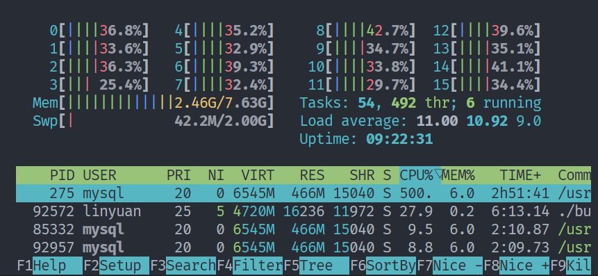
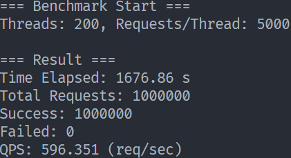
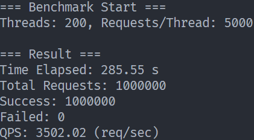

# FlowBike - 高性能共享单车后端服务 (High-Performance C++ Backend)

基于 C++17 实现的高并发共享单车业务后端，采用 Reactor 网络模型，集成 MySQL/Redis 存储架构。
在 WSL2 环境下，经 Benchmark 压测，单机 QPS 从初始的 **60** 提升至 **3500+**。

## 🚀 核心特性 (Key Features)

* **高性能网络**：基于 `Libevent` 封装的 Reactor 模型，支持高并发连接。
* **多线程架构**：实现 `ThreadPool` 线程池处理业务逻辑，IO 线程与业务线程分离。
* **多级存储**：
    * **MySQL**：持久化用户与车辆数据（使用连接池 `ConnectionPool`）。
    * **Redis**：实现验证码/Token 的高频读写与自动过期（ThreadLocal 优化连接获取）。
* **工程化日志**：实施严格的日志分级策略（Log Leveling），将高频 IO 操作降级为 DEBUG。在 Release 模式配合 WARN 级别配置，彻底消除了热点路径的日志开销。
* **健壮性设计**：完善的信号处理（SIGINT/SIGTERM）与资源 RAII 管理。

👉 **[点击查看详细的《核心技术亮点与架构深度解析》](docs/亮点记录.md)**
*(内含：自定义 TCP 协议设计细节、信号处理死锁排查全过程、以及 Reactor 模型重构心得)*

## 🔄 请求处理全流程 (Request Lifecycle Architecture)

下图展示了从 TCP 连接建立、数据包解析、跨线程业务调度，到最终异步回包的完整数据流向。
重点解决了多线程下的**野指针问题**（通过 FD 接力）和**并发写冲突**（通过 IO 队列）。

```text
┌───────────────┐        ① TCP传输(PB序列化的二进制包)
│   客户端      │ ---------------------------------------------▶
└───────────────┘

              NetworkInterface（网络层 - IO线程/主线程）
              ─────────────────────────
                    ↓ ② libevent 回调收到数据 (bev, read_cb)
            ┌─────────────────────────────────────────┐
            │ 解析 header + body                       │
            │ new MobileCodeReqEv(...)                │ ◀─── ③ create_event
            │ ev->set_fd(bufferevent_getfd);   │      (★ 保存连接ID，而非指针)
            └─────────────────────────────────────────┘
                               │
                               │④ dms_->enqueue(std::move(ev))
                               ▼
              DispatchMsgService（调度层 - 线程池）
              ─────────────────────────
                               │⑤ 跨线程调度 process(ev)
                               ▼

              UserEventHandler（业务层 - 业务线程）
              ─────────────────────────
     ┌──────────────────────────────────────────────────┐
     │ 根据 dispatcher_ 查找处理函数                    │
     │ auto rsp = handle_mobile_code_req(req);          │
     │ rsp->set_fd(req->get_fd());               │─── ⑥ ★ FD接力：将ID传给响应
     │ delete req;                                      │─── ⑦ 释放请求事件内存
     └──────────────────────────────────────────────────┘
                               │
                               │⑧ post_response(std::move(rsp))
                               ▼

              DispatchMsgService（调度层）
              ─────────────────────────
                   network_interface->send_response(rsp)
                               │⑨ 放入发送队列 (线程安全)
                               ▼

              NetworkInterface（网络层 - IO线程/主线程）
              ─────────────────────────
     ┌──────────────────────────────────────────────────┐
     │ std::lock_guard lock(resp_mtx);           │
     │ resp_queue.push(std::move(packet));              │─── ⑩ 仅入队，不立即发送
     │ (Timer触发 flush_send_queue)                     │─── ⑪ 异步发送
     │ 查找 connections_.find(fd)                       │─── ★ 检查连接是否还活着
     │ bufferevent_write(bev, header+body)              │─── ⑫ 安全回发
     └──────────────────────────────────────────────────┘

┌───────────────┐        ⑬ TCP传输(PB序列化的二进制包)
│   客户端      │ ◀---------------------------------------------
└───────────────┘
```

重点步骤：
步骤 ③ (set_fd)：这是解决 Segfault 的关键。我们切断了业务层对底层网络对象 (bufferevent) 的直接依赖，只传递一个轻量级的 ID。
步骤 ⑥ (FD 接力)：业务逻辑的闭环。业务层负责告诉底层“这个响应是回复给哪个连接的”。
步骤 ⑩ ~ ⑪ (异步队列)：One Loop One Thread原则。我们禁止业务线程直接操作 Socket，而是把数据扔回给主线程（IO线程）去发。这不仅解决了竞争问题，还保证了发送顺序。
步骤 ⑪ (find fd)：容错性。如果客户端在业务处理期间断开了，主线程查不到 fd 就会安全丢弃，而不会因为访问野指针而崩溃。

## 📊 性能优化演进 (Performance Tuning)

本项目经历了一次完整的性能调优过程，解决了 IO 瓶颈与架构缺陷：

### 阶段一：基准线 (MySQL Sync)
* **QPS**: ~60
* **瓶颈**: MySQL 默认的双一刷盘策略 (`innodb_flush_log_at_trx_commit=1`) 导致严重的 IO Wait。
* **现象**: CPU 占用极低，大量线程阻塞在数据库写入。

### 阶段二：数据库优化 (MySQL Async)
* **QPS**: ~600
* **优化**: 调整 MySQL 刷盘策略，开启 `-O3` Release 编译优化。
* **瓶颈**: `htop` 监控显示 MySQL 进程 CPU 占用率达 500%，达到单机数据库写入计算极限。




### 阶段三：架构升级 (Redis Cache)
* **QPS**: **3502** (最终成果)
* **优化**: 引入 Redis 缓存高频的验证码/Token 生成，将写压力从磁盘转移至内存。
* **结果**: 突破 IO 与 数据库 CPU 瓶颈，性能提升 **50 倍**。




👉 **[点击查看完整的《项目开发与调优排坑实录》](docs/实践总结.md)**
*(包含：详细的 GDB 调试过程、Spdlog 宏冲突排查记录、以及 MySQL/Redis 协议细节分析)*

## 🛠️ 技术栈 (Tech Stack)

* **语言**: C++17
* **网络库**: Libevent
* **数据库**: MySQL 8.0, Redis
* **日志库**: Spdlog
* **序列化**: Protobuf 3
* **构建工具**: CMake, Shell Scripts

## 🏃 如何运行 (How to Run)

### 1. 环境依赖
* Linux (Ubuntu 20.04+ / WSL2)
* MySQL, Redis, CMake, Protobuf

### 2. 编译
```bash
# 默认使用 Release 模式编译
./scripts/build.sh Release
```

### 3. 运行服务端
```bash
./build/flowbike_server
```

### 4. 运行客户端与压测
```bash
# 进行压测
./build/benchmark
# 普通单线程客户端
./build/flowbike_client
```